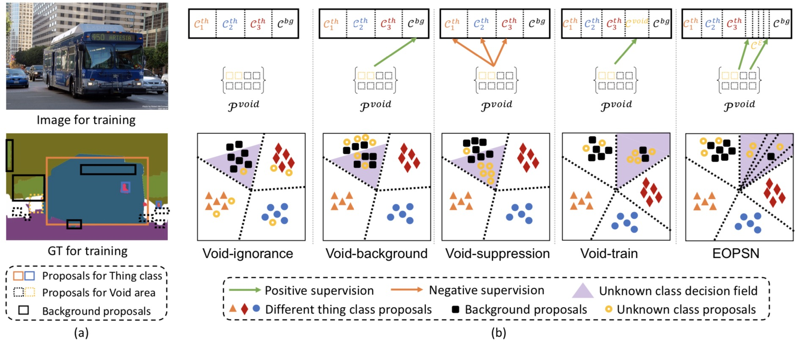
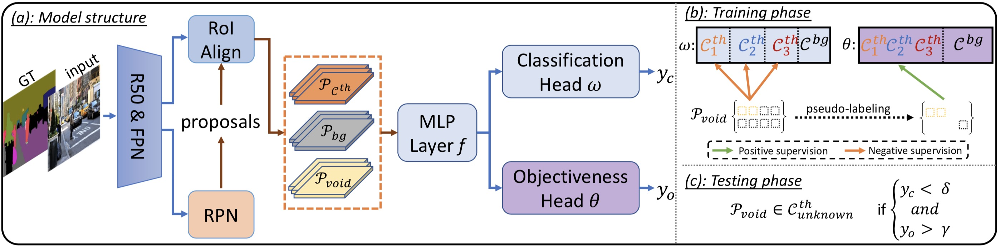

# Dual Decision Improves Open-Set Panoptic Segmentation   

This project contains the implementation of our work for open-set panoptic segmentation:
    
> Dual Decision Improves Open-Set Panoptic Segmentation,
> Hai-Ming Xu, Hao Chen, Lingqiao Liu and Yufei Yin,
> *Accepted to BMVC 2022*
    
The full paper is available at: [Arxiv Link](https://arxiv.org/abs/2207.02504) or [BMVC Official Page](https://bmvc2022.mpi-inf.mpg.de/190/).


## Abstract

Open-set panoptic segmentation (OPS) problem is a new research direction aiming to perform segmentation for both known classes and unknown classes, i.e., the objects (''things'') that are never annotated in the training set. The main challenges of OPS are twofold: (1) the infinite possibility of the unknown object appearances makes it difficult to model them from a limited number of training data. (2) at training time, we are only provided with the ''void'' category, which essentially mixes the ''unknown thing'' and ''background'' classes. We empirically find that directly using ''void'' category to supervise known class or ''background'' classifiers without screening will lead to an unsatisfied OPS result. In this paper, we propose a divide-and-conquer scheme to develop a dual decision process for OPS. We show that by properly combining a known class discriminator with an additional class-agnostic object prediction head, the OPS performance can be significantly improved. Specifically, we first propose to create a classifier with only known categories and let the ''void'' class proposals achieve low prediction probability from those categories. Then we distinguish the ''unknown things'' from the background by using the additional object prediction head. To further boost performance, we introduce ''unknown things''  pseudo-labels generated from up-to-date models to enrich the training set. Our extensive experimental evaluation shows that our approach significantly improves unknown class panoptic quality, with more than 30\% relative improvements than the existing best-performed method.

---

<p align="center">
  
</p>
<p align="center">
  
</p>

## Preparation
Our approach is built upon the open-source codebase of [EOPSN](https://github.com/jd730/EOPSN) and please follow their [tutorial](https://github.com/jd730/EOPSN#usage) for the environment installation and the [data preparation](https://github.com/jd730/EOPSN#data-preparation).


## Training

Our approach can run on a single node with 8 gpus:
```
sh run_efs.sh
```

> Please note that the pseudo-labeling module of our approach can gradually play a role in the training process of the model and thus there is no need for a pre-trained model like in EOPSN.

## Results

<p align="center">
  
</p>

## Acknowledgement
We thank the [EOPSN](https://github.com/jd730/EOPSN) and [detectron2](https://github.com/facebookresearch/detectron2) codebase for their impressive work and open-sourced projects.


## Citations
```
@inproceedings{Xu_2022_BMVC,
    author    = {Haiming Xu and Hao Chen and Lingqiao Liu and Yufei Yin},
    title     = {Dual Decision Improves Open-Set Panoptic Segmentation},
    booktitle = {33rd British Machine Vision Conference 2022, {BMVC} 2022, London, UK, November 21-24, 2022},
    publisher = {{BMVA} Press},
    year      = {2022},
    url       = {https://bmvc2022.mpi-inf.mpg.de/0190.pdf}
}
```